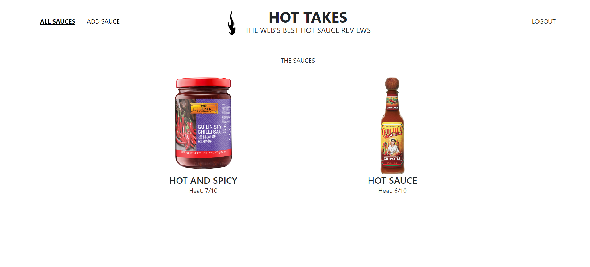

# PIIQUANTE

### Projet 6 | Parcours "Développeur web" OpenClassrooms - Construisez une API sécurisée pour une application d'avis gastronomiques

## Mission

Développer le back-end de l'application web de critique de sauces piquantes appelée "Hot Takes" pour la marque de condiments *Piiquante*. Elle doit permettre aux utilisateurs d'ajouter leurs sauces piquantes préférées et de "liker" et de "disliker" les sauces ajoutées par d'autres utilisateurs.

## Installation

#### Prérequis

* `Node.js`
* `npm`

#### Front-End

* Lien vers l'application front-end du repository du projet : (https://github.com/OpenClassrooms-Student-Center/Web-Developer-P6)
* Cloner le repository
* Ouvrir un terminal
* Exécuter `npm install` à partir du répértoire du projet
* Exécuter `npm start`

#### Back-End

* Cloner le projet
* Ouvrir un terminal
* Exécuter `npm install` à partir de la racine du projet
* Exécuter `node server`

Le back-end s'exécute sur (http://localhost:3000) 

L'application s'ouvre dans le navigateur via le lien suivant : (http://localhost:4200)

## Technologies utilisées

* *Node.js* -> Serveur
* *Express* -> Framework
* *MongoDB* -> Base de données
* *Mongoose* -> Création d'un schéma de données pour la base de données MongoDB

## Spécifications de l'API

Les verbes de requêtes de l'API : *CRUD*

* *Create* : **POST** -> publier
* *Read* : **GET** -> lire
* *Update* : **PUT** -> mettre à jour
* *Delete* : **DELETE** -> supprimer

## Erreurs API

* Les erreurs doivent être renvoyées :
    * Sans modification ni ajout
    * Si nécessaire, utiliser une nouvelle `Error()`

## Routes API

* Pour chaque route *sauce*, les sauces doivent disposer d'une autorisation portant l'en-tête "Bearer" lors de l'envoi du token par le front-end

## Les modèles de données

#### Sauce

* **userId** : *String* - l'identifiant MongoDB unique de l'utilisateur qui a créé la sauce
* **name** : *String* - nom de la sauce
* **manufacturer** : *String* - fabricant de la sauce
* **description** : *String* - description de la sauce
* **mainPepper** : *String* - le principal ingrédient épicé de la sauce
* **imageUrl** : *String* - l'URL de l'image de la sauce téléchargée par l'utilisateur
* **heat** : *Number* - nombre entre 1 et 10 décrivant la sauce
* **likes** : *Number* - nombre d'utilisateurs qui aiment (= like) la sauce
* **dislikes** : *Number* - nombre d'utilisateurs qui n'aiment pas (= dislike) la sauce
* **usersLiked** : *[String]* - tableau des identifiants des utilisateurs qui ont aimé (= liked) la sauce
* **usersDisliked** : *[String]* - tableau des identifiants des utilisateurs qui n'ont pas aimé (= disliked) la sauce

**Like et Dislike**

* Leur nombre total doit être mis à jour à chaque nouvelle notation
* L'ID de l'utilisateur doit être ajouté ou retiré du tableau approprié

#### Utilisateur

* **email** : *String* - adresse email de l'utilisateur **[unique]**
* **password** : *String* - mot de passe de l'utilisateur haché

## Exigences de sécurité

* Sécurisation de la base de données MongoDB selon le RGPD et l'OWASP
* Chiffrage du mot de passe de l'utilisateur
* Authentification renforcée sur toutes les sauces requises
* Adresses emails :
    * Doivent être uniques dans la base de données
    * Utilisation d'un plugin Mongoose doit garantir leur unicité et assurer la remontée des erreurs issues de la base de données
* La sécurité de la base de données MongoDB (à partir d'un service tel que MongoDB Atlas) ne doit pas empêcher l'application de se lancer sur la machine d'un utilisateur
* Création d'un fichier `env` pour le stockage des informations sensibles -> nom d'utilisateur et mot de passe pour la base de données, mot de passe du token 
* Utilisation des versions récentes des logiciels avec des correctifs de sécurité actualisés
* Le contenu du dossier "images" ne doit pas être téléchargé sur GitHub